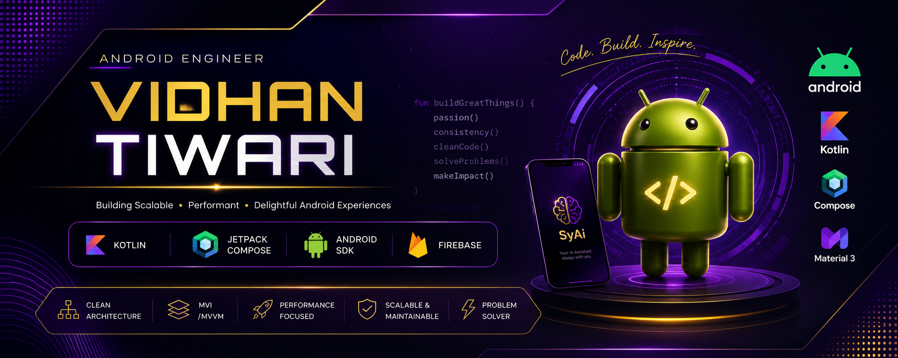

<div align="center">



<br/>


<br/><br/>

<a href="https://drive.google.com/file/d/1Od1LmilnXKu9Zcf8qcIDolOiMU8xSyWx/view?usp=sharing">

</a>

<a href="mailto:vidhantiwari110@gmail.com">

</a>

<a href="https://www.linkedin.com/in/vidhan-tiwari-254819212/">

</a>

<a href="tel:+918059681569">

</a>

<a href="https://leetcode.com/tiwari_vidhan/">

</a>

<br/><br/>

<a href="#about">About</a> •
<a href="#experience">Experience</a> •
<a href="#tech-stack">Tech Stack</a> •
<a href="#projects">Projects</a> •
<a href="#github">GitHub</a> •
<a href="#contact">Contact</a>

</div>

---

<a id="about"></a>

# About Me

I'm **Vidhan Tiwari**, an Android Developer building scalable, high-performance Android applications using modern development practices.

My primary expertise lies in **Kotlin**, **Jetpack Compose**, **Java**, and **Clean Architecture**, with a strong focus on writing maintainable code, creating smooth user experiences, and solving real engineering problems.

Currently focusing on:

- Native Android Development
- Jetpack Compose
- Clean Architecture
- MVI / MVVM
- Android Performance
- Spring Boot Backend
- System Design
- Data Structures & Algorithms

---

<a id="experience"></a>

# Experience

### Android Developer Intern
**Zypp Electric**

Worked on production Android applications used within the EV rental ecosystem.

Highlights

- Built production-ready Android features
- Fixed critical production issues
- Improved application performance
- Worked closely with backend & QA teams
- Built UI using Jetpack Compose
- Integrated REST APIs
- Followed Clean Architecture & MVVM

---

# Android Toolbox

<div align="center">

| Language | Android | Architecture | Backend | Tools |
|----------|----------|--------------|----------|-------|
| Kotlin | Jetpack Compose | MVVM | Firebase | Git |
| Java | Android SDK | MVI | Spring Boot | GitHub |
| Python | XML | Clean Architecture | REST APIs | Android Studio |
| C | Material 3 | Repository Pattern | MySQL | Jira |

</div>

<br/>

<p align="center">


</p>

---

<a id="tech-stack"></a>

# Tech Stack

### Android

- Kotlin
- Jetpack Compose
- XML
- Material 3
- Navigation Compose
- ViewModel
- State Management
- Coroutines
- Flow
- Room
- DataStore
- WorkManager
- Firebase
- Google Maps
- Sensors
- BLE
- CameraX
- Coil
- Retrofit
- OkHttp

### Architecture

- MVVM
- MVI
- Clean Architecture
- Repository Pattern
- SOLID Principles
- Dependency Injection

### Backend

- Spring Boot
- MySQL
- Firebase
- REST APIs

---

# Engineering Principles

✔ Clean Code

✔ Scalable Architecture

✔ Performance Optimization

✔ Offline-first Thinking

✔ Modular Design

✔ Maintainability

✔ Reusable Components

✔ User-first Design

---

# Current Focus

```text
Android Development      ████████████████████ 95%

Jetpack Compose          ███████████████████░ 92%

Kotlin                   ██████████████████░░ 90%

System Design            ████████████░░░░░░░ 65%

Spring Boot              ███████████░░░░░░░░ 60%
```

---

# LeetCode

<div align="center">

<a href="https://leetcode.com/tiwari_vidhan/">


</a>

</div>

---

<a id="github"></a>

# GitHub Analytics
<br/>


<br/><br/>


</div>

---

# Activity Graph

<div align="center">


</div>

---

<a id="projects"></a>

# Featured Projects

## SyAi — AI Personal Assistant

Modern Android AI assistant focused on productivity, fitness, reminders, notes and AI-powered conversations.

**Highlights**

- Jetpack Compose
- Kotlin
- Sensors
- AI Integration
- Clean Architecture
- MVI

Repository

https://github.com/Nerd0Vidhan/SyAi-Public

---

## Annapurna

Food donation platform connecting NGOs, volunteers and donors.

**Highlights**

- Firebase Authentication
- Google Maps
- Realtime Database
- Kotlin

Repository

https://github.com/shreyagargg/annapurna-food-charity-app

---

## Virse

Secure real-time messaging application.

Highlights

- Java
- Firebase
- Realtime Messaging
- Cloud Storage

Repository

https://github.com/Nerd0Vidhan/Virse-Chat-app

---

# Currently Learning

- Spring Boot
- CI/CD
- Compose Multiplatform
- Advanced Android Performance
- System Design

---

# Contact

<div align="center">

<a href="mailto:vidhantiwari110@gmail.com">

</a>

<a href="tel:+918059681569">

</a>

<a href="https://www.linkedin.com/in/vidhan-tiwari-254819212/">

</a>

<a href="https://leetcode.com/tiwari_vidhan/">

</a>

<a href="https://drive.google.com/file/d/1Od1LmilnXKu9Zcf8qcIDolOiMU8xSyWx/view?usp=sharing">

</a>

</div>

---

<div align="center">

*"Great software is built one thoughtful commit at a time."*

<br/>

Made with Kotlin, coffee, and curiosity.

</div>
